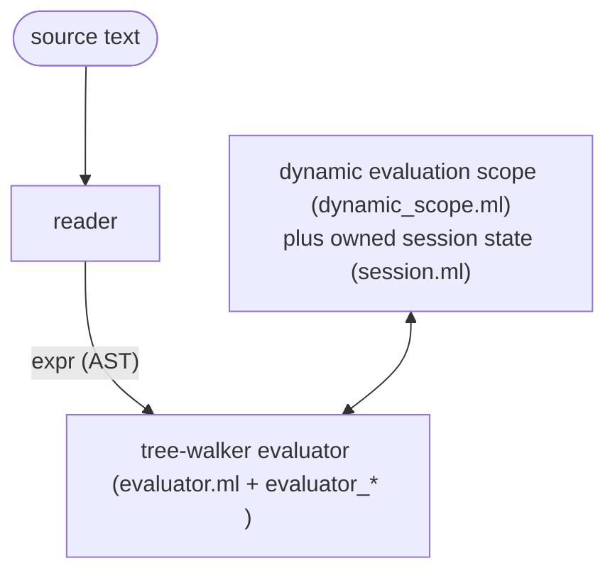

# pp architecture

This describes the moving parts of pp: how a program flows through the
system, and what each source file is responsible for. See
[GLOSSARY.md](GLOSSARY.md) for term definitions and [SPEC.md](SPEC.md) for
the semantics these parts must honor.

## The pipeline



pp has one front end and one engine: the reader turns source text into an
`expr` AST, and the tree-walker evaluates it directly.

The tree-walker is the reference implementation — the oracle. Correctness is
checked by a metamorphic fuzzer (see [TESTING.md](TESTING.md)): it generates
semantics-preserving program twins and asserts they produce identical output,
plus a reader round-trip gate. This is the project's most valuable correctness
check.


## The core model

Everything hangs off a few mutually recursive types:

- `expr`: the AST. Covers literals, symbols, `if`, `let`/`let*`, `fn`,
  application, `quote`/`force`/`delay`, `effect`/`perform`/`with-handler`,
  `node`/`defnode`, `module`/`import`/`load`, `island`, `with-config`/`config`,
  and type annotations and source locations.
- `value`: runtime data, including scalars, collections, closures,
  keyword, symbol, pair, vector, map, set, closure, builtin, capability,
  thunk, and module-env-map.
- `thunk`: a suspended computation. It holds a mutable status
  (`Unevaluated`, `Evaluating`, or `Evaluated`), a precomputed content hash,
  its expression and captured environment, and a persist flag (true for
  `node`, false for `let`/`delay`).
- `env`: an environment node. It holds a list of `(name, value)` bindings,
  a precomputed, incrementally built `env_hash`, and a stable id, giving
  environment identity constant-time lookup instead of a recursive
  traversal.
- `closure`: captured parameters, body, and environment.
- `capability`: an authority token for filesystem, network, process,
  compose, restrict, or none.

Only these mutually recursive declarations live in `core_model.ml`.
Operations over them have explicit owners: `identity.ml` defines structural
hashing, `environment.ml` constructs and queries environments and suspended
computations, `free_vars.ml` analyzes expressions, and the quotation, pattern,
presentation, and value-analysis modules own their respective pure walks.

## Content addressing

Identity in pp is a content hash, SHA-256, computed by `hasher.ml` via
Cryptokit. This is the single idea most of the rest of the system depends on.

- `env_hash` builds incrementally: extending an environment with
  `(name, value)` hashes `(parent_hash, name, hash_value value)`.
- A thunk's key is `hash(expr, env_hash, capabilities, config, handlers)`.
  Two thunks with the same key are the same thunk. The tree-walker
  memoizes them in a shared `thunk_store`.
- A closure's hash folds in its captured `env_hash`.

The key must include everything the computation depends on, or distinct
computations collide. Leaving out the captured environment, or the
ambient handler stack, once let distinct computations collide in
`thunk_store` and return stale results; the key folds in both.

This in-memory dedup mirrors the persistent store described below in "The
persistent node cache".

## Evaluation and `force`

A `let` binding or `delay` produces a thunk. `force` drives a thunk to a
value. It memoizes the result (`Evaluating` moves to `Evaluated`), detects
self-reference as an infinite-recursion error, and switches from the native
OCaml stack to a heap-allocated trampoline past a depth threshold, so deep
chains do not overflow.

before its body runs. Tail calls run in constant stack space, using CPS
continuations.

## Effects and capabilities

- Effects: `perform` looks up a dynamic handler stack, falling back to
  builtins such as `read-file`, `write-file`, and `log` when unhandled.
  restoring it on normal return, on exception, and on tail call.
- Capabilities (`capability.ml`): authority tokens for filesystem,
  network, and process access. They enter the system only at the root,
  through `--grant`, which `cli.ml` parses and `app_context.ml` validates into
  the initial capability set.
  User code cannot construct a capability, only narrow or combine one,
  using `cap-restrict` or `cap-compose`. Filesystem reads, writes, and
  `slurp` calls are checked at perform time, against the full path, matched
  component by component.

## Evaluation state

`Session.t` owns evaluation- and pass-lifetime state: thunk memoization,
macros and gensyms, domains and probes, observations, sealed and file pins,
fenced actions, and stabilization's node index. Its named lifecycle operations
reset or retain those families at evaluation, pass, and watch boundaries.
Independent sessions share no mutable evaluation state. Each session also
owns one `Scheduler.t`, which carries policy, remote dispatch, fork
bookkeeping, and fork instrumentation. `dynamic_scope.ml` provides bracketed
dynamic effect scopes while evaluating a session; it owns no mutable resources
or registries.

The application constructs the scheduler and passes its narrow remote
dispatcher at the same boundary where it constructs the session. The
application wraps the run in the scheduler's signal-handler scope, which
restores the previous SIGINT handler on every exit path. There is no mutable
callback-installation step and no process-global scheduler state, so two
sessions can carry different policies and dispatchers.

The sole tree walker constructs one immutable evaluator operation graph. Its
exhaustive expression dispatch and tail mechanism remain in `evaluator.ml`;
the narrow semantic helpers in `evaluator_*` contain no second dispatcher:
thunk construction, application, persistent-node forcing, effects, sequential
forms/modules, dynamic scopes, and pattern-arm selection each receive explicit
callbacks for the operations they need. This keeps the evaluator navigable
without splitting language semantics into competing engines.

The operation graph contains:
`force`, `eval`, and `apply`, plus a separate node-policy view for keying,
rebuilding, and hit resolution. `app_context.ml` supplies that complete value to each
new session. Consumers receive only the view they need; macro expansion receives
frontend services explicitly at each source-entry boundary, and plain deep
forcing receives only `force`. There are no installable evaluator callbacks.

## The persistent node cache

`Store_layout` owns the on-disk layout, version initialization, and the single
atomic-replacement implementation. Immutable object and blob repositories and
the locked trace repository sit above it. `Cache_policy` consumes repository
handles and observations, but knows no paths. It is wired into the
tree-walker's `force` for `node { e }` thunks.

On a cache miss, `force` pushes a trace frame and runs the node. Because
`slurp` and `read-file` record observations, collecting every
`(file-cell, content-hash)` pair the node read. `force` then stores the
result blob, keyed by its hash, and appends a trace to the node key's set
of traces.

On the next force, `Cache_policy.lookup` re-observes each recorded cell and serves
the stored result only if some trace still verifies against the world.
Reads propagate to every enclosing node frame, so a parent node gets the
transitive closure of everything its children read. What a node observed
governs validity (SPEC law 21) — pp's dynamic answer to Haskell's static
IO type.

`Node.key_of` resolves the free variables from the captured environment,
forces and authorizes them, and passes only explicit code/free-variable hash
inputs to the abstract `Node_key` constructor. Node keys, result object hashes,
observed hashes, and cell ids are distinct types; conversion to store text is
confined to repository and transport edges. The key leaves out the
whole-environment hash and the capability set (SPEC law 20).

Persistent execution is assembled by `Node.force`: `lookup_hit` verifies and
serves a trace, `replay_node_reads` propagates nested reads, `rebuild` runs a
miss, `validate_result` enforces the node boundary, and the persistence helpers
write the result and trace. Serial forcing and scheduler workers both invoke
the same `rebuild` operation.

A node that raises an evaluative error stores a failing trace and re-serves the
same error until a recorded read changes (SPEC law 28). A raising thunk resets
away from `Evaluating` rather than getting stuck there. A hit is served only if
the caller is authorized to read the whole closure of cells the trace depends
on, checked by `Cache_policy.lookup ~authorized` and `Observation.authorized`
(SPEC law 23b). `Source_error.cache_decision` exhaustively keeps capability
errors out of the persistent failure cache while allowing evaluative failures
to be cached.

Boundary failures use `Source_error.t` variants for readers, evaluation,
capabilities, stores, transport, command validation, and recoverable
operations. Locations are fields, not text parsed by callers. Files,
descriptors, locks, temporary outputs, child processes, and node sandboxes are
owned by `Fun.protect` scopes at their construction sites. Cleanup that is
only a safety net is named as best-effort and cannot replace an atomic write,
descriptor close, or child reap.


With `pp --watch --stabilize`, the reverse-edge index built by
`Store_index.reverse` maps changed cells to dirty node keys.
`Stabilize.reset_dirty` marks only those in-memory thunks `Unevaluated`.
The session lifecycle keeps the thunk memo alive across watch
iterations, so clean nodes skip repository lookup entirely.

`Observation` is the exhaustive boundary for constructing, parsing, recording,
replaying, re-observing, and authorizing every cell kind. File, stat, env, argv,
config, handler, probe, sealed, domain, tool, and tree reads all pass through
it. Session owns the probe and domain registries it consults; cache policy has no
upward observer callback. The retired, never-produced `proc:` spelling parses
as unknown so an old trace conservatively misses while its bytes remain
readable. Inline-nested cutoff remains absent.

## Islands (`island.ml`)

`island("<uri>", "64-hex-pin")` is a content-addressed module. The inline
pin is the canonical tree hash of the island's source. Because `hash_expr`
folds the uri and the pin together, the pin becomes part of any enclosing
node's key. Island identity is structural, needing no lockfile or
synthetic trace cell.

Resolution serves only the immutable cached tree at
`~/.pp/islands/src/<pin>/`, re-verified against the pin on every resolve;
tampering is a hard error.

The tree-walker evaluates the pinned `entry.pp` as a module, with `VEnvMap`
exports through `EIsland`. An unpinned form is a hard error that names the fix.
`pp --update` re-resolves the source, re-hashing a file island or fetching
a git island, and rewrites the pins, refusing to run rather than
half-write the source on any ambiguity.

Fetching over `git:` or `github:` is opt-in runtime authority, through
`--fetch-islands`, not a capability a user's own code can hold. Every fetch
is journaled as an `island fetch` entry and governed by
[THREAT-MODEL-islands.md](THREAT-MODEL-islands.md) (SPEC law 24).

## File-by-file responsibilities

The source is split into four wrapped Dune libraries with physical directory
boundaries. The compiled module graph is:

```text
pp.kernel   -> cryptokit, dune-build-info
pp.frontend -> pp.kernel
pp.runtime  -> pp.kernel, pp.frontend, unix
pp.app      -> pp.kernel, pp.frontend, pp.runtime, unix, cryptokit
```

`pp.kernel` is Unix-free and owns semantic data and pure operations. `pp.frontend`
owns readers, printers, and source lowering. `pp.runtime` contains the sole
evaluator and the cache/world implementations that currently form one practical
runtime boundary; it is the only lower library linked with Unix. `pp.app`
constructs host services and dispatches commands. Wrapping makes cross-library
ownership explicit (`Pp_kernel.*`, `Pp_frontend.*`, and `Pp_runtime.*`).
`tools/check-dependencies.sh`, exposed as `dune build @architecture`, checks the
declared graph and the Unix restriction.

The source directories are therefore the library map:

| Directory | Library | Role |
|---|---|---|
| `src/kernel/` | `pp.kernel` | semantic types, identity, capabilities, codecs, and pure operations |
| `src/frontend/` | `pp.frontend` | readers, printers, desugaring, surface tables, and lint |
| `src/runtime/` | `pp.runtime` | evaluator, dynamic scope, cache/repositories, world implementations, and runtime services |
| `src/app/` | `pp.app` | invocation parsing, command composition, production construction, and `main.ml` |

The file-by-file table below is exhaustive; its qualified paths are the
ownership source of truth.

### Library-owned files

| File | Role |
|---|---|
| `src/kernel/core_model.ml` | The minimum recursive declarations for expressions, values, environments, closures, and thunks. |
| `src/kernel/source_error.ml` | Source locations and the language's located error vocabulary. |
| `src/kernel/identity.ml` | Structural hashes for values, expressions, patterns, and capabilities. |
| `src/kernel/identity_types.ml` | Abstract node-key, object-hash, observed-hash, and cell-id types, plus explicit node-key construction. |
| `src/kernel/environment.ml` | Environment lookup/extension and closure/thunk construction. |
| `src/kernel/free_vars.ml` | Free-variable analysis used by node identity. |
| `src/kernel/value_analysis.ml` | Cycle-safe inspection for authority and sealed values. |
| `src/kernel/quotation.ml` | Total expression/value quotation conversion. |
| `src/kernel/pattern_match.ml` | Pure pattern matching and binding extraction. |
| `src/kernel/presentation.ml` | Runtime value presentation and list/string projections. |
| `src/kernel/hasher.ml` | Low-level SHA-256 and injective length-framed hashing primitives. |
| `src/kernel/blobref.ml` | Detection of `blob:<sha256>` references embedded in an ordinary value, so large bytes stay out of a node's small result. |
| `src/runtime/force_deep.ml` | The deep structural force and its session-scheduler-aware batch collection/dispatch boundary. |
| `src/kernel/codec.ml` | The one canonical, versioned, byte-stable text encoding for store objects and traces. |
| `src/kernel/constant_time.ml` | Constant-time byte comparison, used to verify signed tokens without a timing side channel. |
| `src/kernel/paths.ml` | The one component-boundary path-containment predicate, `Paths.under`, behind capability scopes, loader authority, and domain bounds. |
| `src/kernel/cell.ml` | The closed cell taxonomy and its byte-stable `parse`/`serialize` mapping. |
| `src/runtime/observation.ml` | Typed cell construction, observation hashes, record/replay, re-observation, and hit authorization. |
| `src/frontend/surface_tables.ml` | The closed surface sets (sigils, observation heads, lowering templates) as data, plus the renderer for SPEC's generated block. |
| `src/frontend/desugar.ml` | Reader-level desugars shared by both readers (SPEC Appendix B). |
| `src/frontend/comments.ml` | The side channel `pp fmt` uses to carry comments across a surface transpile. |
| `src/kernel/cap_token.ml` | Signed capability grants — cluster tokens — for cross-machine authority. |
| `src/kernel/invocation.ml` | The abstract, immutable, validated command invocation: source roots, initial authority, program arguments/files, reconciliation and GC inputs. |
| `src/kernel/host_services.ml` | The immutable interface for canonicalization, time, home discovery, and secret-file I/O; production construction lives in `app_context.ml`, while tests use complete deterministic values. |
| `src/kernel/effects.ml` | The OCaml 5 effect declarations that hold handler, config, and trace state in dynamic extent. |
| `src/kernel/evaluator_ops.ml` | Immutable, capability-shaped evaluator operations: semantic force/eval/apply and the narrower node-policy view. Each session receives a complete value at construction. |
| `src/kernel/version.ml` | Single source of truth for the version string. |

### Remaining library-owned files

| File | Role |
|---|---|
| `src/frontend/reader.ml` | Reentrant s-expression lexer and parser to the `expr` AST — the `.ppl` macro surface — with source and line tracking owned by an abstract parser state. |
| `src/frontend/reader_braces.ml` | Reentrant brace-surface parser (`.pp`/`.ppb`, SPEC Appendix B) to the same `expr` AST; its abstract state owns deterministic generated names. |
| `src/frontend/printer_braces.ml` | Renders an `expr` back to brace-surface text: the `pp fmt --to-braces` half. |
| `src/frontend/printer_sexpr.ml` | Renders an `expr` back to s-expression text: the `--to-sexpr` half. |
| `src/runtime/dynamic_scope.ml` | Bracketed OCaml effect scopes for capabilities, config, handlers, traces, nodes, domains, and observation collection. |
| `src/runtime/world_path.ml` | Canonical filesystem paths and discovery of the installed standard library. |
| `src/runtime/loader.ml` | Source loading under bounded interpreter authority, including trace recording. |
| `src/runtime/error_context.ml` | Attaches the innermost source-form location to evaluation errors. |
| `src/runtime/sandbox.ml` | Creates, resolves, and removes node-local scratch directories. |
| `src/runtime/session.ml` | The abstract owner of evaluation/pass state, including the session domain registry and fenced pass state, its scheduler handle, explicit function invocation, a complete immutable evaluator-operation value, and its `begin_evaluation`, `begin_pass`, and `begin_watch` lifecycle transitions. |
| `src/runtime/evaluator.ml` | The project's sole tree-walking engine: one exhaustive expression dispatch, tail mechanism, force/trampoline, and operation graph. |
| `src/runtime/evaluator_thunks.ml` | Content-addressed thunk construction, letrec poison thunks, and module export selection. |
| `src/runtime/evaluator_application.ml` | Closure/builtin application, explicit builtin environments, and the shared tail-call continuation mechanism. |
| `src/runtime/evaluator_node.ml` | The evaluator-facing adapter for persistent-node forcing and nested trace replay. |
| `src/runtime/evaluator_effects.ml` | Dynamic handler lookup and the builtin effect fallback. |
| `src/runtime/evaluator_forms.ml` | Sequential blocks, module evaluation, source loading, and top-level form evaluation. |
| `src/runtime/evaluator_scope.ml` | Capability, handler, config, and config-read dynamic-scope forms. |
| `src/runtime/evaluator_match.ml` | Pattern-arm matching, guard evaluation, and arm environment extension. |
| `src/runtime/macro.ml` | `defmacro` expansion: a function from syntax-as-values to syntax, run at the expansion boundary. |
| `src/runtime/primitives.ml` | Declarative builtin descriptors, categorized registration, and initial-environment materialization. |
| `src/runtime/node.ml` | Free-variable resolution, node identity, trace replay, hit policy, result validation, rebuilding, and persistence. |
| `src/runtime/store_layout.ml` | Abstract store layout and version initialization, with the single atomic-replacement and crash-injection boundary. |
| `src/runtime/object_repository.ml` | Immutable encoded values and fenced specifications addressed by hash. |
| `src/runtime/blob_repository.ml` | Immutable byte blobs addressed by hash. |
| `src/runtime/trace_repository.ml` | Locked trace sets with canonical byte-stable encoding. |
| `src/runtime/cache_policy.ml` | Trace selection, verification, authorization, replay, diagnostics, and GC marking over repository handles. |
| `src/runtime/cell_repository.ml` | Snapshot reads and sealed/file pins over observations and the blob repository. |
| `src/runtime/store_index.ml` | Read-only reverse-index and graph queries over traces. |
| `src/runtime/repository_inventory.ml` | Artifact metadata and removal lifecycle used by explicit GC. |
| `src/runtime/store_gc.ml` | Explicit `pp gc`: mark-by-replay over recent epochs and sweep through repository inventory — never automatic. |
| `src/runtime/gcroots.ml` | The GC roots manifest naming the epochs `pp gc` marks from. |
| `src/runtime/journal.ml` | The append-only intent and done audit log: a typed `entry` variant, byte-stable line codec, atomic append, and durable fenced-action state queries (SPEC law 31). It does not choose recovery policy. |
| `src/runtime/fenced.ml` | The narrowly scoped fenced-effect mechanics: registers scripting-tier actions, journals intent and done entries, and executes a recovery decision supplied by the command boundary (SPEC law 31). |
| `src/runtime/island.ml` | Islands: parses file, git, and github URIs; runs the content-addressed cache and tamper verification; rewrites pins for `--update`; provides `island-pins`; and fetches over git only when asked. |
| `src/runtime/domain_prims.ml` | The trusted mechanics that back in-language domains: atomic `materialize-file` and `remove-file`, `tree-observe`, `proc-spawn`, `proc-alive?`, `proc-stop`, `proc-reap`, and `domain-state-get`/`put` — owning no policy of its own. |
| `src/runtime/domains.ml` | Typed domain pipeline: pass preparation and stratification, observation, diff/plan construction, apply journaling, verification, and epoch recording. `stdlib/domain-fs.pp` and `domain-proc.pp` hold the filesystem and process policy as pp source. |
| `src/runtime/reconciliation.ml` | Explicit command-owned reconciliation lifecycle: it binds an invocation to a session, sequences a prepared domain pass, drains the session-owned fenced pass, and delegates recovery decisions without owning journal persistence. |
| `src/runtime/process.ml` | The `run` process effect: executes an external command under capability. |
| `src/runtime/scheduler.ml` | The explicitly constructed fork-at-dispatch scheduler handle for node misses (`serial`, `parallel:N`, `race:N`, `remote:MEMBER`), including child ownership and signal lifecycle. |
| `src/runtime/remote.ml` | Builds the narrow remote dispatcher that sends data-closed node misses to a named cluster member over the transport. |
| `src/runtime/transport.ml` | Cross-machine sync of hash-named store artifacts, plus the capability-gated serve-hit path. |
| `src/runtime/stabilize.ml` | The push scheduler: a side table from `node_key` to `thunk`, plus dirty reset using `Store_index`'s reverse edges. |
| `src/runtime/repl.ml` | REPL and file-execution helpers. |
| `src/app/cli.ml` | Raw flag collection, validation, typed invocation options, and canonical help rows; callbacks do not execute commands or mutate runtime policy. |
| `src/app/app_context.ml` | Production host services and per-command invocation, store, scheduler, session, evaluator, and reconciliation composition. |
| `src/app/command_dispatch.ml` | Command precedence, signal scope, and top-level command dispatch. |
| `src/app/command_eval.ml` | Run/eval execution, pin dumps, and schedule transparency checks. |
| `src/app/command_frontend.ml` | Format, surface emission, round-trip, comment, and hash comparison commands. |
| `src/app/command_developer.ml` | Help, version, property, lint, graph, and island-pins command entry points. |
| `src/app/command_run.ml` | Source execution, domain glue, desired-state construction, and host-slice selection. |
| `src/app/command_reconcile.ml` | Recovery policy and reconcile/supervise pass execution. |
| `src/app/command_watch.ml` | Watch polling and stabilize dirty propagation. |
| `src/app/command_island.ml` | Island update command lifecycle. |
| `src/app/command_cluster.ml` | Cluster initialization, transport, publish/serve, pin preparation, and remote member lifecycle. |
| `src/app/command_gc.ml` | Explicit GC and mark-by-replay command lifecycle. |
| `src/app/kernel_props.ml` | Derived generators and the kernel properties (hash injectivity, quote/printer round-trip) the fuzzer checks. |
| `src/frontend/lint.ml` | The convention checker for pp source files. |
| `src/runtime/fswalk.ml` | One shared filesystem tree walk for its several callers. |

### Entry point and tools

| File | Role |
|---|---|
| `src/app/main.ml` | Startup, CLI parse/validation, production host construction, dispatch, and top-level error-to-exit conversion. |
| `tools/fuzz.ml` | The metamorphic fuzzer, described in [TESTING.md](TESTING.md). |

## CLI surface (`src/app/cli.ml`)

Run `pp --help` for the canonical flag list. This document does not
duplicate it, since an earlier copy here drifted out of date. A single
A single typed table drives help text and raw parsing; validated options are
passed to command modules, so command behavior is not hidden in flag callbacks.
