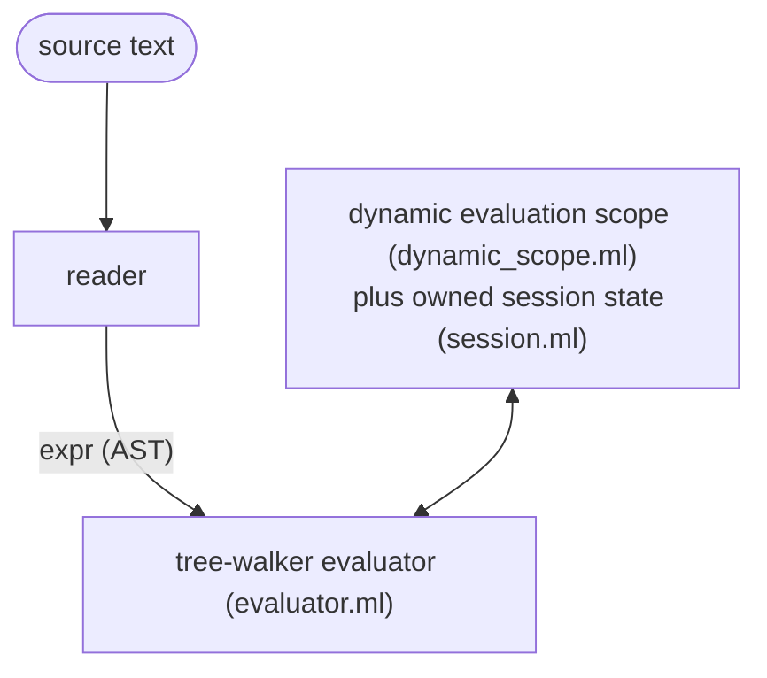

# pp architecture

This describes the moving parts of pp: how a program flows through the
system, and what each source file is responsible for. See
[GLOSSARY.md](GLOSSARY.md) for term definitions and [SPEC.md](SPEC.md) for
the semantics these parts must honor.

## The pipeline

pp has one front end and one engine: the reader turns source text into an
`expr` AST, and the tree-walker evaluates it directly.

The tree-walker is the reference implementation — the oracle. Correctness is
checked by a metamorphic fuzzer (see [TESTING.md](TESTING.md)): it generates
semantics-preserving program twins and asserts they produce identical output,
plus a reader round-trip gate. This is the project's most valuable correctness
check.

## The core model

Everything hangs off a few mutually recursive types:

- `expr`: the AST. Covers literals, symbols, `if`, `let`/`let*`, `fn`,
  application, `quote`/`force`/`delay`, `effect`/`perform`/`with-handler`,
  `node`/`defnode`, `module`/`import`/`load`, `island`, `with-config`/`config`,
  and type annotations and source locations.
- `value`: runtime data, including scalars, collections, closures,
  keyword, symbol, pair, vector, map, set, closure, builtin, capability,
  thunk, and module-env-map.
- `thunk`: a suspended computation. It holds a mutable status
  (`Unevaluated`, `Evaluating`, or `Evaluated`), a precomputed content hash,
  its expression and captured environment, and a persist flag (true for
  `node`, false for `let`/`delay`).
- `env`: an environment node. It holds a list of `(name, value)` bindings,
  a precomputed, incrementally built `env_hash`, and a stable id, giving
  environment identity constant-time lookup instead of a recursive
  traversal.
- `closure`: captured parameters, body, and environment.
- `capability`: an authority token for filesystem, network, process,
  compose, restrict, or none.

Only these mutually recursive declarations live in `core_model.ml`.
Operations over them have explicit owners: `identity.ml` defines structural
hashing, `environment.ml` constructs and queries environments and suspended
computations, `free_vars.ml` analyzes expressions, and the quotation, pattern,
presentation, and value-analysis modules own their respective pure walks.

## Content addressing

Identity in pp is a content hash, SHA-256, computed by `hasher.ml` via
Cryptokit. This is the single idea most of the rest of the system depends on.

- `env_hash` builds incrementally: extending an environment with
  `(name, value)` hashes `(parent_hash, name, hash_value value)`.
- A thunk's key is `hash(expr, env_hash, capabilities, config, handlers)`.
  Two thunks with the same key are the same thunk. The tree-walker
  memoizes them in a shared `thunk_store`.
- A closure's hash folds in its captured `env_hash`.

The key must include everything the computation depends on, or distinct
computations collide. Leaving out the captured environment, or the
ambient handler stack, once let distinct computations collide in
`thunk_store` and return stale results; the key folds in both.

This in-memory dedup mirrors the persistent store described below in "The
persistent node cache".

## Evaluation and `force`

A `let` binding or `delay` produces a thunk. `force` drives a thunk to a
value. It memoizes the result (`Evaluating` moves to `Evaluated`), detects
self-reference as an infinite-recursion error, and switches from the native
OCaml stack to a heap-allocated trampoline past a depth threshold, so deep
chains do not overflow.

before its body runs. Tail calls run in constant stack space, using CPS
continuations.

## Effects and capabilities

- Effects: `perform` looks up a dynamic handler stack, falling back to
  builtins such as `read-file`, `write-file`, and `log` when unhandled.
  restoring it on normal return, on exception, and on tail call.
- Capabilities (`capability.ml`): authority tokens for filesystem,
  network, and process access. They enter the system only at the root,
  through `--grant`, which `main.ml` parses into the initial capability set.
  User code cannot construct a capability, only narrow or combine one,
  using `cap-restrict` or `cap-compose`. Filesystem reads, writes, and
  `slurp` calls are checked at perform time, against the full path, matched
  component by component.

## Evaluation state

`Session.t` owns evaluation- and pass-lifetime state: thunk memoization,
macros and gensyms, domains and probes, observations, sealed and file pins,
fenced actions, and stabilization's node index. Its named lifecycle operations
reset or retain those families at evaluation, pass, and watch boundaries.
Independent sessions share no mutable evaluation state. `dynamic_scope.ml`
provides bracketed dynamic effect scopes while evaluating a session; it owns no
mutable resources or registries.

The sole tree walker constructs one immutable evaluator operation graph:
`force`, `eval`, and `apply`, plus a separate node-policy view for keying,
rebuilding, and hit resolution. `main.ml` supplies that complete value to each
new session. Consumers receive only the view they need; macro expansion receives
frontend services explicitly at each source-entry boundary, and plain deep
forcing receives only `force`. There are no installable evaluator callbacks.

## The persistent node cache (`store.ml`)

The persistent content-addressed store lives at `~/.pp/store/objects` and
`traces`. It is wired into the tree-walker's `force` for `node { e }`
thunks.

On a cache miss, `force` pushes a trace frame and runs the node. Because
`slurp` and `read-file` call `Store.record_file_read`, this collects every
`(file-cell, content-hash)` pair the node read. `force` then stores the
result blob, keyed by its hash, and appends a trace to the node key's set
of traces.

On the next force, `Store.hit` re-observes each recorded cell and serves
the stored result only if some trace still verifies against the world.
Reads propagate to every enclosing node frame, so a parent node gets the
transitive closure of everything its children read. What a node observed
governs validity (SPEC law 21) — pp's dynamic answer to Haskell's static
IO type.

The node key, from `node_key_of`, hashes the code structure plus the
value hashes of the free variables the node references (`Free_vars.free_vars`),
forced call-by-value. It leaves out the whole-environment hash and the
capability set (SPEC law 20).

A node that raises a `Failure` stores a failing trace and re-serves the
same error until a recorded read changes (SPEC law 28). A raising thunk
resets away from `Evaluating` rather than getting stuck there. A hit is
served only if the caller is authorized to read the whole closure of cells
the trace depends on, checked by `Store.hit ~authorized` and
`cell_authorized` (SPEC law 23b). A capability denial, `Capability_error`,
is never memoized.

With `pp --watch --stabilize`, the reverse-edge index built by
`Store.build_reverse_index` maps changed cells to dirty node keys.
`Stabilize.reset_dirty` marks only those in-memory thunks `Unevaluated`.
The session lifecycle keeps the thunk memo alive across watch
iterations, so clean nodes skip `Store.hit` entirely.

This is still narrow. It covers file cells only, folds config and handlers
into the key rather than tracking them as separate traces, and has no
cutoff for inline-nested nodes.

## Islands (`island.ml`)

`island("<uri>", "64-hex-pin")` is a content-addressed module. The inline
pin is the canonical tree hash of the island's source. Because `hash_expr`
folds the uri and the pin together, the pin becomes part of any enclosing
node's key. Island identity is structural, needing no lockfile or
synthetic trace cell.

Resolution serves only the immutable cached tree at
`~/.pp/islands/src/<pin>/`, re-verified against the pin on every resolve;
tampering is a hard error.

The tree-walker evaluates the pinned `entry.pp` as a module, with `VEnvMap`
exports through `EIsland`. An unpinned form is a hard error that names the fix.
`pp --update` re-resolves the source, re-hashing a file island or fetching
a git island, and rewrites the pins, refusing to run rather than
half-write the source on any ambiguity.

Fetching over `git:` or `github:` is opt-in runtime authority, through
`--fetch-islands`, not a capability a user's own code can hold. Every fetch
is journaled as an `island fetch` entry and governed by
[THREAT-MODEL-islands.md](THREAT-MODEL-islands.md) (SPEC law 24).

## File-by-file responsibilities

The source splits into two dune libraries. `pp.kernel` is pure — no Unix,
no side effects — and holds the types, hashing, and the closed vocabulary
everything else is checked against. `pp` builds on it and may touch the
world (files, processes, the network). `main.ml` is the thin entry point;
`tools/fuzz.ml` is the metamorphic fuzzer.
### Kernel (`pp.kernel`, pure)

| File | Role |
|---|---|
| `src/core_model.ml` | The minimum recursive declarations for expressions, values, environments, closures, and thunks. |
| `src/source_error.ml` | Source locations and the language's located error vocabulary. |
| `src/identity.ml` | Structural hashes for values, expressions, patterns, and capabilities. |
| `src/environment.ml` | Environment lookup/extension and closure/thunk construction. |
| `src/free_vars.ml` | Free-variable analysis used by node identity. |
| `src/value_analysis.ml` | Cycle-safe inspection for authority and sealed values. |
| `src/quotation.ml` | Total expression/value quotation conversion. |
| `src/pattern_match.ml` | Pure pattern matching and binding extraction. |
| `src/presentation.ml` | Runtime value presentation and list/string projections. |
| `src/hasher.ml` | Low-level SHA-256 and injective length-framed hashing primitives. |
| `src/blobref.ml` | Detection of `blob:<sha256>` references embedded in an ordinary value, so large bytes stay out of a node's small result. |
| `src/force_deep.ml` | The one deep recursive force over a value — the plain structural walk that drives every reachable thunk. |
| `src/codec.ml` | The one canonical, versioned, byte-stable text encoding for store objects and traces. |
| `src/constant_time.ml` | Constant-time byte comparison, used to verify signed tokens without a timing side channel. |
| `src/paths.ml` | The one component-boundary path-containment predicate, `Paths.under`, behind capability scopes, loader authority, and domain bounds. |
| `src/cell.ml` | The typed cell taxonomy: the `Cell.t` variant plus `of_string` and `to_string`, with the on-disk strings frozen — naming only; observation and authority live in `store.ml` and `evaluator.ml`. |
| `src/surface_tables.ml` | The closed surface sets (sigils, observation heads, lowering templates) as data, plus the renderer for SPEC's generated block. |
| `src/desugar.ml` | Reader-level desugars shared by both readers (SPEC Appendix B). |
| `src/comments.ml` | The side channel `pp fmt` uses to carry comments across a surface transpile. |
| `src/cap_token.ml` | Signed capability grants — cluster tokens — for cross-machine authority. |
| `src/invocation.ml` | The abstract, immutable, validated command invocation: source roots, initial authority, program arguments/files, reconciliation and GC inputs. |
| `src/host_services.ml` | The immutable interface for canonicalization, time, home discovery, and secret-file I/O; production operations are composed in `main.ml`, while tests use complete deterministic values. |
| `src/effects.ml` | The OCaml 5 effect declarations that hold handler, config, and trace state in dynamic extent. |
| `src/evaluator_ops.ml` | Immutable, capability-shaped evaluator operations: semantic force/eval/apply and the narrower node-policy view. Each session receives a complete value at construction. |
| `src/version.ml` | Single source of truth for the version string. |

### Application library (`pp`)

| File | Role |
|---|---|
| `src/reader.ml` | Reentrant s-expression lexer and parser to the `expr` AST — the `.ppl` macro surface — with source and line tracking owned by an abstract parser state. |
| `src/reader_braces.ml` | Reentrant brace-surface parser (`.pp`/`.ppb`, SPEC Appendix B) to the same `expr` AST; its abstract state owns deterministic generated names. |
| `src/printer_braces.ml` | Renders an `expr` back to brace-surface text: the `pp fmt --to-braces` half. |
| `src/printer_sexpr.ml` | Renders an `expr` back to s-expression text: the `--to-sexpr` half. |
| `src/dynamic_scope.ml` | Bracketed OCaml effect scopes for capabilities, config, handlers, traces, nodes, domains, and observation collection. |
| `src/world_path.ml` | Canonical filesystem paths and discovery of the installed standard library. |
| `src/loader.ml` | Source loading under bounded interpreter authority, including trace recording. |
| `src/error_context.ml` | Attaches the innermost source-form location to evaluation errors. |
| `src/sandbox.ml` | Creates, resolves, and removes node-local scratch directories. |
| `src/session.ml` | The abstract owner of evaluation/pass state, a complete immutable evaluator-operation value, and its `begin_evaluation`, `begin_pass`, and `begin_watch` lifecycle transitions. |
| `src/evaluator.ml` | The tree-walking evaluator, the project's sole engine, implementing `force`, `eval`, `apply`, and the immutable operation graph. |
| `src/macro.ml` | `defmacro` expansion: a function from syntax-as-values to syntax, run at the expansion boundary. |
| `src/primitives.ml` | Built-in functions and the initial environment. |
| `src/node.ml` | The node-key skeleton and the node rebuilder. |
| `src/store.ml` | The persistent content-addressed store and its verifying traces, wired into `force` for `node { e }`. |
| `src/store_gc.ml` | Explicit `pp gc`: mark-by-replay over the recent epochs, sweep the rest — never automatic. |
| `src/gcroots.ml` | The GC roots manifest naming the epochs `pp gc` marks from. |
| `src/journal.ml` | The append-only intent and done audit log: a typed `entry` variant, `to_line` and `of_line`, and the scanners that find fenced-effect entries (SPEC law 31). |
| `src/fenced.ml` | The fenced-effect executor: registers scripting-tier actions, journals intent and done entries, and resolves unknown-status entries by policy (SPEC law 31). |
| `src/island.ml` | Islands: parses file, git, and github URIs; runs the content-addressed cache and tamper verification; rewrites pins for `--update`; provides `island-pins`; and fetches over git only when asked. |
| `src/domain_prims.ml` | The trusted mechanics that back in-language domains: atomic `materialize-file` and `remove-file`, `tree-observe`, `proc-spawn`, `proc-alive?`, `proc-stop`, `proc-reap`, and `domain-state-get`/`put` — owning no policy of its own. |
| `src/domains.ml` | Generic domain orchestration: the journal bracket, `observed_all` suspension, threading capabilities into observe and apply, plan caching through direct `Store` calls with no synthetic node, verify-after-write, and stratification. `stdlib/domain-fs.pp` and `domain-proc.pp` hold the filesystem and process policy as pp source; `main.ml` then drains fenced actions. |
| `src/process.ml` | The `run` process effect: executes an external command under capability. |
| `src/scheduler.ml` | The fork-at-dispatch process-pool scheduler for node misses (`serial`, `parallel:N`, `race:N`, `remote:MEMBER`). |
| `src/remote.ml` | Remote placement: dispatches a batch of node misses to a named cluster member over the transport. |
| `src/transport.ml` | Cross-machine sync of hash-named store artifacts, plus the capability-gated serve-hit path. |
| `src/stabilize.ml` | The push scheduler: a side table from `node_key` to `thunk`, plus dirty reset. The reverse-edge index itself lives in `store.ml`. |
| `src/repl.ml` | REPL and file-execution helpers. |
| `src/kernel_props.ml` | Derived generators and the kernel properties (hash injectivity, quote/printer round-trip) the fuzzer checks. |
| `src/lint.ml` | The convention checker for pp source files. |
| `src/fswalk.ml` | One shared filesystem tree walk for its several callers. |

### Entry point and tools

| File | Role |
|---|---|
| `src/main.ml` | The CLI entry point: the one typed flag table, `--grant` parsing, and dispatch to the REPL, a file, or `-e`. |
| `tools/fuzz.ml` | The metamorphic fuzzer, described in [TESTING.md](TESTING.md). |

## CLI surface (`main.ml`)

Run `pp --help` for the canonical flag list. This document does not
duplicate it, since an earlier copy here drifted out of date. A single
typed table drives help text, parsing, and dispatch together, so they
cannot disagree.
