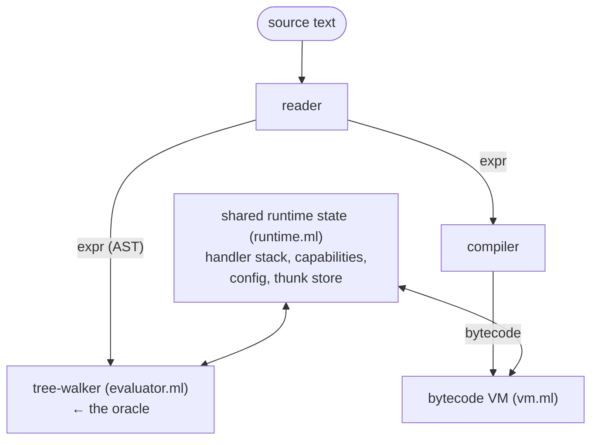

# pp architecture

This describes the moving parts of pp: how a program flows through the
system, and what each source file is responsible for. See
[GLOSSARY.md](GLOSSARY.md) for term definitions and [SPEC.md](SPEC.md) for
the semantics these parts must honor.

## The pipeline

pp has one front end and two back ends: the reader turns source text into
an `expr` AST, the tree-walker interprets it directly, and the compiler
instead turns it into bytecode for the VM.

Both back ends share one pool of runtime state and one set of data types
and hashing definitions, letting pp run them against each other — using
`--diff` and the fuzzer — and check that they agree.

The tree-walker is the simple, obviously correct reference — the oracle.
The VM is the faster execution model. Any disagreement between the two is
a bug. Differential testing catches it (see [TESTING.md](TESTING.md)):
the project's most valuable correctness check.

## The data model (`types.ml`)

Everything hangs off a few mutually recursive types:

- `expr`: the AST. Covers literals, symbols, `if`, `let`/`let*`, `fn`,
  application, `quote`/`force`/`delay`, `effect`/`perform`/`with-handler`,
  `node`/`defnode`, `module`/`import`/`load`, `island`, `with-config`/`config`,
  and type annotations and source locations.
- `value`: the runtime representation. Covers nil, bool, int, float, string,
  keyword, symbol, pair, vector, map, set, closure, builtin, capability,
  thunk, module-env-map, and bytecode.
- `thunk`: a suspended computation. It holds a mutable status
  (`Unevaluated`, `Evaluating`, or `Evaluated`), a precomputed content hash,
  its expression and captured environment, and a persist flag (true for
  `node`, false for `let`/`delay`).
- `env`: an environment node. It holds a list of `(name, value)` bindings,
  a precomputed, incrementally built `env_hash`, and a stable id, giving
  environment identity constant-time lookup instead of a recursive
  traversal.
- `closure`: captured parameters, body, and environment in the tree-walker;
  a bytecode offset and captured frames in the VM.
- `capability`: an authority token for filesystem, network, process,
  compose, restrict, or none.
- `frame`: the VM's mutable, growable array of local variables.

`types.ml` also holds the content-addressing logic: `hash_value`,
`hash_expr`, `hash_capability`, and the incremental `env_hash`
construction.

## Content addressing

Identity in pp is a content hash, SHA-256, computed by `hasher.ml` via
Cryptokit. This is the single idea most of the rest of the system depends on.

- `env_hash` builds incrementally: extending an environment with
  `(name, value)` hashes `(parent_hash, name, hash_value value)`.
- A thunk's key is `hash(expr, env_hash, capabilities, config, handlers)`.
  Two thunks with the same key are the same thunk. The tree-walker
  memoizes them in a shared `thunk_store`.
- A closure's hash folds in its captured `env_hash`.

The key must include everything the computation depends on, or distinct
computations collide. Leaving out the captured environment, or the
ambient handler stack, once let distinct computations collide in
`thunk_store` and return stale results; the key folds in both.

This in-memory dedup mirrors the persistent store described below in "The
persistent node cache".

## Evaluation and `force`

A `let` binding or `delay` produces a thunk. `force` drives a thunk to a
value. It memoizes the result (`Evaluating` moves to `Evaluated`), detects
self-reference as an infinite-recursion error, and switches from the native
OCaml stack to a heap-allocated trampoline past a depth threshold, so deep
chains do not overflow.

Application is strict — call-by-value: a function's arguments are forced
before its body runs. Tail calls run in constant stack space in both back
ends. The tree-walker uses CPS continuations; the VM uses a `TAIL_CALL`
frame-swap.

## Effects and capabilities

- Effects: `perform` looks up a dynamic handler stack, falling back to
  builtins such as `read-file`, `write-file`, and `log` when unhandled.
  `with-handler`, `effect`, and `with-config` push and pop that state,
  restoring it on normal return, on exception, and on tail call, in both
  back ends.
- Capabilities (`capability.ml`): authority tokens for filesystem,
  network, and process access. They enter the system only at the root,
  through `--grant`, which `main.ml` parses into the initial capability set.
  User code cannot construct a capability, only narrow or combine one,
  using `cap-restrict` or `cap-compose`. Filesystem reads, writes, and
  `slurp` calls are checked at perform time, against the full path, matched
  component by component.

## The VM path (`compiler.ml`, `vm.ml`)

`compiler.ml` lowers the `expr` AST to a flat array of stack-machine
opcodes. These run on a stack machine, using `LOAD_LOCAL (depth, slot)` and
`STORE_LOCAL slot` against mutable frames.

The compiler tracks a compile-time environment, `cenv`, to resolve names to
`(depth, slot)` pairs. Reusing a slot across binding lifetimes while a
captured frame is still live is a soundness trap the slot allocation
avoids.

`vm.ml` executes the opcodes. It creates thunks with `MAKE_THUNK` and
closures with `MAKE_CLOSURE` that capture live frames. Effect dispatch,
capability extraction, type checks, and node forcing all delegate to
`evaluator.ml`.

The VM compiles `ENode` to a dedicated `MAKE_NODE` opcode, carrying the body
AST and free-variable descriptors, and forces it through the same
persistent store as the tree-walker.

## Shared state (`runtime.ml`)

Both back ends read and write one set of module-global references: the
handler stack, the current capability set, the config stack, the thunk
store, and the trace-frame stack nodes push while forcing so world-reads
land in the right trace. This also covers the initial `--grant`
capabilities, the registry of scripting-tier fenced actions
(`Runtime.fenced_actions`), and the unknown-status policy
(`Runtime.fenced_policy`).

Consolidating this state into one `Runtime` module removed a class of
parity bugs from separate per-backend copies drifting apart.

## The persistent node cache (`store.ml`)

The persistent content-addressed store lives at `~/.pp/store/objects` and
`traces`. It is wired into the tree-walker's `force` for `node { e }`
thunks.

On a cache miss, `force` pushes a trace frame and runs the node. Because
`slurp` and `read-file` call `Store.record_file_read`, this collects every
`(file-cell, content-hash)` pair the node read. `force` then stores the
result blob, keyed by its hash, and appends a trace to the node key's set
of traces.

On the next force, `Store.hit` re-observes each recorded cell and serves
the stored result only if some trace still verifies against the world.
Reads propagate to every enclosing node frame, so a parent node gets the
transitive closure of everything its children read. What a node observed
governs validity (SPEC law 21) — pp's dynamic answer to Haskell's static
IO type.

The node key, from `node_key_of`, hashes the code structure plus the
value hashes of the free variables the node references (`Types.free_vars`),
forced call-by-value. It leaves out the whole-environment hash and the
capability set (SPEC law 20).

A node that raises a `Failure` stores a failing trace and re-serves the
same error until a recorded read changes (SPEC law 28). A raising thunk
resets away from `Evaluating` rather than getting stuck there. A hit is
served only if the caller is authorized to read the whole closure of cells
the trace depends on, checked by `Store.hit ~authorized` and
`cell_authorized` (SPEC law 23b). A capability denial, `Capability_error`,
is never memoized.

The VM shares this store. `MAKE_NODE` records the free-variable
descriptors the compiler resolved. `vm_node_key` rebuilds the same node key
from the captured frames and globals; for data free variables this is
byte-identical to the tree-walker's key, so the two back ends share
entries. `force_node_thunk` runs the same hit, verify, trace, failure, and
capability logic as the tree-walker.

With `pp --watch --stabilize`, the reverse-edge index built by
`Store.build_reverse_index` maps changed cells to dirty node keys.
`Stabilize.reset_dirty` marks only those in-memory thunks `Unevaluated`.
`Runtime.keep_thunks` keeps the `thunk_store` alive across watch
iterations, so clean nodes skip `Store.hit` entirely.

This is still narrow. It covers file cells only, folds config and handlers
into the key rather than tracking them as separate traces, and has no
cutoff for inline-nested nodes.

## Islands (`island.ml`)

`island("<uri>", "64-hex-pin")` is a content-addressed module. The inline
pin is the canonical tree hash of the island's source. Because `hash_expr`
folds the uri and the pin together, the pin becomes part of any enclosing
node's key. Island identity is structural, needing no lockfile or
synthetic trace cell.

Resolution serves only the immutable cached tree at
`~/.pp/islands/src/<pin>/`, re-verified against the pin on every resolve;
tampering is a hard error.

Both back ends evaluate the pinned `entry.pp` as a module, with `VEnvMap`
exports: the tree-walker through `EIsland`, the VM through a dedicated
`ISLAND` opcode. An unpinned form is a hard error that names the fix.
`pp --update` re-resolves the source, re-hashing a file island or fetching
a git island, and rewrites the pins, refusing to run rather than
half-write the source on any ambiguity.

Fetching over `git:` or `github:` is opt-in runtime authority, through
`--fetch-islands`, not a capability a user's own code can hold. Every fetch
is journaled as an `island fetch` entry and governed by
[THREAT-MODEL-islands.md](THREAT-MODEL-islands.md) (SPEC law 24).

## File-by-file responsibilities

The source splits into two dune libraries. `pp.kernel` is pure — no Unix,
no side effects — and holds the types, hashing, and the closed vocabulary
everything else is checked against. `pp` builds on it and may touch the
world (files, processes, the network). `main.ml` is the thin entry point;
`tools/fuzz.ml` is the differential fuzzer.

### Kernel (`pp.kernel`, pure)

| File | Role |
|---|---|
| `src/types.ml` | All core types: `expr`, `value`, `thunk`, `env`, `closure`, `capability`, `frame`, and opcodes, plus the structural content-addressed hashing (`hash_value`, `hash_expr`, `env_hash`) — the foundation of the codebase. |
| `src/hasher.ml` | The low-level content-addressing primitives (SHA-256 via Cryptokit, `hash_concat`, `hex_encode`) that `types.ml`'s structural hashing is built on. |
| `src/blobref.ml` | Detection of `blob:<sha256>` references embedded in an ordinary value, so large bytes stay out of a node's small result. |
| `src/force_deep.ml` | The one deep recursive force over a value — the plain structural walk that drives every reachable thunk. |
| `src/codec.ml` | The one canonical, versioned, byte-stable text encoding for store objects and traces. |
| `src/constant_time.ml` | Constant-time byte comparison, used to verify signed tokens without a timing side channel. |
| `src/paths.ml` | The one component-boundary path-containment predicate, `Paths.under`, behind capability scopes, loader authority, and domain bounds. |
| `src/cell.ml` | The typed cell taxonomy: the `Cell.t` variant plus `of_string` and `to_string`, with the on-disk strings frozen — naming only; observation and authority live in `store.ml` and `evaluator.ml`. |
| `src/surface_tables.ml` | The closed surface sets (sigils, observation heads, lowering templates) as data, plus the renderer for SPEC's generated block. |
| `src/capability.ml` | Authority tokens and the scope checks (filesystem, network, process, secret), matched path component by component. |
| `src/desugar.ml` | Reader-level desugars shared by both readers (SPEC Appendix B). |
| `src/comments.ml` | The side channel `pp fmt` uses to carry comments across a surface transpile. |
| `src/cap_token.ml` | Signed capability grants — cluster tokens — for cross-machine authority. |
| `src/effects.ml` | The OCaml 5 effect declarations that hold handler, config, and trace state in dynamic extent. |
| `src/backend.ml` | The one record of init-time hook functions that breaks the kernel↔library dependency cycle. |
| `src/version.ml` | Single source of truth for the version string. |

### Runtime library (`pp`)

| File | Role |
|---|---|
| `src/reader.ml` | S-expression lexer and parser to the `expr` AST — the `.ppl` macro surface — also desugaring `and`, `or`, and quasiquote. |
| `src/reader_braces.ml` | The brace-surface parser (`.pp`/`.ppb`, SPEC Appendix B) to the same `expr` AST. |
| `src/printer_braces.ml` | Renders an `expr` back to brace-surface text: the `pp fmt --to-braces` half. |
| `src/printer_sexpr.ml` | Renders an `expr` back to s-expression text: the `--to-sexpr` half. |
| `src/runtime.ml` | Shared mutable runtime state used by both back ends. |
| `src/evaluator.ml` | The tree-walking evaluator, and the project's oracle, holding `force`, `eval`, effects, the `thunk_store`, and the shared node rebuilder (`force_node`, `run_node_body`) both back ends use. |
| `src/macro.ml` | `defmacro` expansion: a function from syntax-as-values to syntax, run at the expansion boundary. |
| `src/compiler.ml` | Turns the `expr` AST into bytecode, also running the compile-time environment and slot allocation. |
| `src/vm.ml` | The bytecode stack machine: effect dispatch, type checks, and node forcing all delegate to `evaluator.ml`, so one implementation serves both back ends. |
| `src/primitives.ml` | Built-in functions and the initial environment. |
| `src/node.ml` | The node-key skeleton and the one node rebuilder both back ends share. |
| `src/store.ml` | The persistent content-addressed store and its verifying traces, wired into `force` for `node { e }` in both back ends. |
| `src/store_gc.ml` | Explicit `pp gc`: mark-by-replay over the recent epochs, sweep the rest — never automatic. |
| `src/gcroots.ml` | The GC roots manifest naming the epochs `pp gc` marks from. |
| `src/journal.ml` | The append-only intent and done audit log: a typed `entry` variant, `to_line` and `of_line`, and the scanners that find fenced-effect entries (SPEC law 31). |
| `src/fenced.ml` | The fenced-effect executor: registers scripting-tier actions, journals intent and done entries, and resolves unknown-status entries by policy (SPEC law 31). |
| `src/island.ml` | Islands: parses file, git, and github URIs; runs the content-addressed cache and tamper verification; rewrites pins for `--update`; provides `island-pins`; and fetches over git only when asked. |
| `src/domain_prims.ml` | The trusted mechanics that back in-language domains: atomic `materialize-file` and `remove-file`, `tree-observe`, `proc-spawn`, `proc-alive?`, `proc-stop`, `proc-reap`, and `domain-state-get`/`put` — owning no policy of its own. |
| `src/domains.ml` | Generic domain orchestration: the journal bracket, `observed_all` suspension, threading capabilities into observe and apply, plan caching through direct `Store` calls with no synthetic node, verify-after-write, and stratification. `stdlib/domain-fs.pp` and `domain-proc.pp` hold the filesystem and process policy as pp source; `main.ml` then drains fenced actions. |
| `src/process.ml` | The `run` process effect: executes an external command under capability. |
| `src/scheduler.ml` | The fork-at-dispatch process-pool scheduler for node misses (`serial`, `parallel:N`, `race:N`, `remote:MEMBER`). |
| `src/remote.ml` | Remote placement: dispatches a batch of node misses to a named cluster member over the transport. |
| `src/transport.ml` | Cross-machine sync of hash-named store artifacts, plus the capability-gated serve-hit path. |
| `src/stabilize.ml` | The push scheduler: a side table from `node_key` to `thunk`, plus dirty reset. The reverse-edge index itself lives in `store.ml`. |
| `src/repl.ml` | REPL and file-execution helpers for both back ends. |
| `src/kernel_props.ml` | Derived generators and the kernel properties (hash injectivity, quote/printer round-trip) the fuzzer checks. |
| `src/lint.ml` | The convention checker for pp source files. |
| `src/fswalk.ml` | One shared filesystem tree walk for its several callers. |

### Entry point and tools

| File | Role |
|---|---|
| `src/main.ml` | The CLI entry point: the one typed flag table, `--grant` parsing, and dispatch to the REPL, a file, `-e`, or `--diff`. |
| `tools/fuzz.ml` | The differential fuzzer, described in [TESTING.md](TESTING.md). |

## CLI surface (`main.ml`)

Run `pp --help` for the canonical flag list. This document does not
duplicate it, since an earlier copy here drifted out of date. A single
typed table drives help text, parsing, and dispatch together, so they
cannot disagree.
